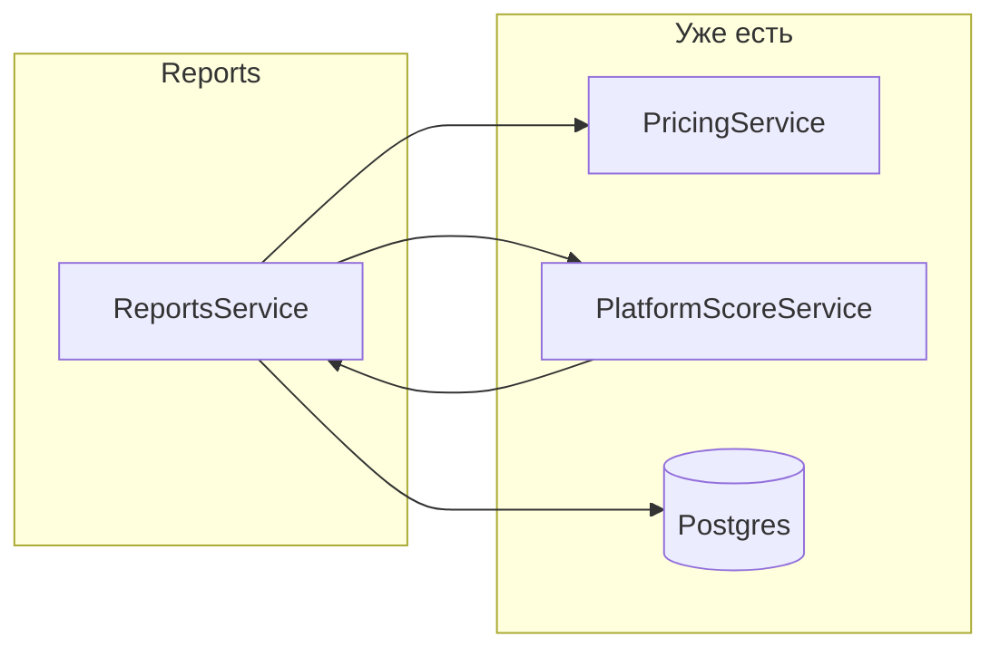

# Урок 9 — Reports API

**Где работаешь:** `C:\AutoFact\autofact-solo\apps\api`  
**Эталон смотреть:** `autofact-learn/apps/api/src/reports/`  
**Эталон не трогаем.**  
**Статус:** [ ] не начат  
**Делает:** только ты  

**Предусловие:** Уроки 6–8 сданы (Pricing, Platform Score).

---

## Карта шагов (что / зачем)

| Шаг | Что | Зачем |
|-----|-----|--------|
| **0** | Папка `reports/` + файлы | Куда класть код модуля |
| **1** | Prisma: `CarReport` + migrate | Сохранять отчёты в БД и читать их потом |
| **2** | DTO create + list query | Принять и проверить вход (создание / фильтры каталога) |
| **3** | `OptionalJwtAuthGuard` | Карточка доступна гостю; с токеном — понять владельца |
| **4** | `ReportsService` | Логика: черновик → publish → каталог → карточка → score по VIN |
| **5** | `ReportsController` | HTTP-адреса для Swagger/клиента |
| **6** | Module → AppModule | Подключить Nest: DI Pricing/PlatformScore + роуты |
| **7** | Проверка в Swagger | Убедиться, что create → publish → list → getOne работает |

**Порядок работы:** шаги 0–3 → в шаге 4 только `createDraft` → остальные методы по одному → 5 → 6 → 7.

---

## Куда писать (шпаргалка)

Все пути от `C:\AutoFact\autofact-solo\apps\api\`.

| Шаг | Файл | Что туда |
|-----|------|----------|
| 0 | создать файлы ниже | пустые заготовки |
| 1 | `prisma/schema.prisma` | enum + модель `CarReport` + `reports` у эксперта |
| 2 | `src/reports/reports.dto.ts` | классы `CreateReportDto`, `ListReportsQueryDto` |
| 3 | `src/common/guards/jwt-auth.guard.ts` | **дописать** класс `OptionalJwtAuthGuard` (рядом с уже существующим `JwtAuthGuard`) |
| 4 | `src/reports/reports.service.ts` | вся логика методов |
| 5 | `src/reports/reports.controller.ts` | маршруты HTTP |
| 6a | `src/reports/reports.module.ts` | связать controller + service + импорты |
| 6b | `src/app.module.ts` | добавить `ReportsModule` в `imports` |
| 7 | — | только Swagger, код не пишем |

**Не путать с эталоном:** в learn DTO лежит в `src/reports/dto/reports.dto.ts`.  
В **solo** держим проще — один файл `src/reports/reports.dto.ts` (без подпапки `dto/`).  
Импорт: `from './reports.dto'`.

---

## Цель урока

1. **Prisma:** модель `CarReport`, enum `ReportStatus`, миграция  
2. **ReportsModule** — сервис + контроллер  
3. **Жизненный цикл:** черновик → publish  
4. **Каталог:** `GET /reports` с фильтрами и **живой ценой** (Pricing)  
5. **Карточка:** `GET /reports/:id` (публичный preview / полный доступ владельцу)  
6. **Platform Score по VIN** при publish + `recalculatePlatformScore`  
7. **`OptionalJwtAuthGuard`** — JWT необязателен на карточке  

**Не в этом уроке:** upload медиа (урок 10), аукционный лист/defects JSON (11), покупка и lock по purchase (12).

---

## Зачем (из жизни)

До сих пор Pricing и Platform Score — **чистая математика** без БД.  
Reports — первый **бизнес-объект**: осмотр машины, который эксперт создаёт, публикует, клиент видит в каталоге.

```
Эксперт → POST /reports (DRAFT)
       → POST /reports/:id/publish (PUBLISHED)
       → если VIN совпал с другими — пересчёт platformScore по VIN

Клиент → GET /reports (каталог + цена «на сейчас»)
      → GET /reports/:id (preview или полный отчёт для владельца)
```

---

## Связь модулей



| Момент | Кто вызывается |
|--------|----------------|
| `list` / `getOne` | `pricing.getPriceKopecks(base, createdAt, now)` |
| `publish` + VIN | `platformScore.calculate(...)` → `updateMany` по VIN |
| `disputed` | `ReportStatus.DISPUTED` на всех отчётах VIN |

Подробнее про freshness / latest per expert — [`../7_PLATFORM_SCORE.md`](../7_PLATFORM_SCORE.md) (v2, после MVP).

---

## Шаг 0. Структура файлов

Создай папку и файлы (можно пустые):

```
autofact-solo/apps/api/
  prisma/
    schema.prisma              ← шаг 1 (уже есть файл — ДОПИСАТЬ)
  src/
    common/guards/
      jwt-auth.guard.ts        ← шаг 3 (файл уже есть — ДОПИСАТЬ класс)
    reports/                   ← НОВАЯ папка
      reports.dto.ts           ← шаг 2
      reports.service.ts       ← шаг 4
      reports.controller.ts    ← шаг 5
      reports.module.ts        ← шаг 6
    app.module.ts              ← шаг 6 (ДОПИСАТЬ import)
```

PowerShell:

```powershell
cd C:\AutoFact\autofact-solo\apps\api
mkdir src\reports
New-Item src\reports\reports.dto.ts, src\reports\reports.service.ts, src\reports\reports.controller.ts, src\reports\reports.module.ts -ItemType File
```

---

## Шаг 1. Prisma — schema

**Файл:** `prisma/schema.prisma`  
**Действие:** дописать в **этот же** файл (не создавать новый).

1. Enum `ReportStatus` рядом с другими enum.  
2. В `ExpertProfile` — строка `reports CarReport[]`.  
3. Модель `CarReport` целиком.

```prisma
enum ReportStatus {
  DRAFT
  PUBLISHED
  ARCHIVED
  DISPUTED
}

model ExpertProfile {
  // ... существующие поля ...
  reports CarReport[]
}

model CarReport {
  id                 String        @id @default(cuid())
  expertId           String
  expert             ExpertProfile @relation(fields: [expertId], references: [id], onDelete: Cascade)
  vin                String?
  make               String
  model              String
  year               Int
  mileage            Int
  engineScore        Int           // техника 1–10
  bodyScore          Int           // кузов 1–10
  paintScore         Int           @default(7)
  interiorScore      Int           // салон 1–10
  tiresScore         Int           @default(7)
  electricsScore     Int           @default(7)
  expertOverallScore Decimal       @db.Decimal(4, 2)
  basePriceKopecks   Int
  status             ReportStatus  @default(DRAFT)
  platformScore      Decimal?      @db.Decimal(4, 2)
  title              String
  summary            String        @default("")
  expertNotes        String        @default("")
  region             String
  city               String
  createdAt          DateTime      @default(now())
  updatedAt          DateTime      @updatedAt
  publishedAt        DateTime?

  @@index([status, createdAt])
  @@index([region])
  @@index([make, model])
  @@index([vin])
  @@index([expertId])
}
```

Миграция (из папки `apps/api`):

```powershell
cd C:\AutoFact\autofact-solo\apps\api
npx prisma migrate dev --name car_reports
npx prisma generate
```

---

## Шаг 2. DTO

**Файл:** `src/reports/reports.dto.ts`  
**Действие:** весь код ниже — **в этот файл** (оба класса в одном файле).

Минимальный набор (без `DefectDto` — урок 11):

```typescript
import {
  IsInt,
  IsOptional,
  IsString,
  Max,
  Min,
  MinLength,
} from 'class-validator';
import { Type } from 'class-transformer';
import { ApiProperty, ApiPropertyOptional } from '@nestjs/swagger';

export class CreateReportDto {
  @ApiProperty()
  @IsString()
  @MinLength(2)
  title!: string;

  @ApiPropertyOptional()
  @IsOptional()
  @IsString()
  summary?: string;

  @ApiPropertyOptional()
  @IsOptional()
  @IsString()
  expertNotes?: string;

  @ApiPropertyOptional()
  @IsOptional()
  @IsString()
  vin?: string;

  @ApiProperty()
  @IsString()
  make!: string;

  @ApiProperty()
  @IsString()
  model!: string;

  @ApiProperty()
  @Type(() => Number)
  @IsInt()
  @Min(1980)
  year!: number;

  @ApiProperty()
  @Type(() => Number)
  @IsInt()
  @Min(0)
  mileage!: number;

  @ApiProperty({ description: 'Техника 1–10' })
  @Type(() => Number)
  @IsInt()
  @Min(1)
  @Max(10)
  engineScore!: number;

  @ApiProperty()
  @Type(() => Number)
  @IsInt()
  @Min(1)
  @Max(10)
  bodyScore!: number;

  @ApiProperty()
  @Type(() => Number)
  @IsInt()
  @Min(1)
  @Max(10)
  paintScore!: number;

  @ApiProperty()
  @Type(() => Number)
  @IsInt()
  @Min(1)
  @Max(10)
  interiorScore!: number;

  @ApiPropertyOptional()
  @Type(() => Number)
  @IsOptional()
  @IsInt()
  @Min(1)
  @Max(10)
  tiresScore?: number;

  @ApiPropertyOptional()
  @Type(() => Number)
  @IsOptional()
  @IsInt()
  @Min(1)
  @Max(10)
  electricsScore?: number;

  @ApiProperty({ description: 'Базовая цена в копейках' })
  @Type(() => Number)
  @IsInt()
  @Min(100)
  basePriceKopecks!: number;

  @ApiProperty()
  @IsString()
  region!: string;

  @ApiProperty()
  @IsString()
  city!: string;
}

export class ListReportsQueryDto {
  @ApiPropertyOptional()
  @IsOptional()
  @IsString()
  make?: string;

  @ApiPropertyOptional()
  @IsOptional()
  @IsString()
  model?: string;

  @ApiPropertyOptional()
  @IsOptional()
  @IsString()
  region?: string;

  @ApiPropertyOptional()
  @IsOptional()
  @Type(() => Number)
  @IsInt()
  @Min(1)
  page?: number = 1;

  @ApiPropertyOptional()
  @IsOptional()
  @Type(() => Number)
  @IsInt()
  @Min(1)
  @Max(50)
  limit?: number = 12;
}
```

---

## Шаг 3. OptionalJwtAuthGuard

**Файл:** `src/common/guards/jwt-auth.guard.ts`  
**Действие:** файл уже есть с `JwtAuthGuard` — **допиши снизу** второй класс. Не создавай новый файл.

Импорт `ExecutionContext` должен быть из `@nestjs/common` (если ещё нет — добавь в существующий import).

```typescript
@Injectable()
export class OptionalJwtAuthGuard extends AuthGuard('jwt') {
  async canActivate(context: ExecutionContext): Promise<boolean> {
    try {
      await super.canActivate(context);
    } catch {
      return true;
    }
    return true;
  }

  handleRequest<TUser>(_err: Error | null, user: TUser): TUser | null {
    return user ?? null;
  }
}
```

Имя метода именно **`canActivate`**, не `canActive`.

На `GET /reports/:id`: гость без токена видит preview; с токеном эксперт-владелец — полный отчёт.

---

## Шаг 4. ReportsService — ключевые методы

**Файл:** `src/reports/reports.service.ts`  
**Эталон смотреть:** `autofact-learn/apps/api/src/reports/reports.service.ts`  
**Действие:** весь service — **только в этом файле**. Импорт DTO: `from './reports.dto'`.

Сначала каркас:

```typescript
import {
  ForbiddenException,
  Injectable,
  NotFoundException,
} from '@nestjs/common';
import { ReportStatus, Role } from '@prisma/client';
import { PrismaService } from '../prisma/prisma.service';
import { PricingService } from '../pricing/pricing.service';
import { PlatformScoreService } from '../platform-score/platform-score.service';
import { CreateReportDto, ListReportsQueryDto } from './reports.dto';
import { AuthUser } from '../common/decorators/current-user.decorator';

@Injectable()
export class ReportsService {
  constructor(
    private readonly prisma: PrismaService,
    private readonly pricing: PricingService,
    private readonly platformScore: PlatformScoreService,
  ) {}

  // дальше методы 4.1 → 4.6 по одному
}
```

### 4.1 createDraft *(пиши первым)*

Всё ещё в **`reports.service.ts`**.

- Только `EXPERT` / `ADMIN`
- Найти `ExpertProfile` по `userId`
- `expertOverallScore` = среднее 6 оценок (engine, body, paint, interior, tires, electrics)
- `status: DRAFT`

```typescript
const overall =
  (dto.engineScore +
    dto.bodyScore +
    dto.paintScore +
    dto.interiorScore +
    (dto.tiresScore ?? 7) +
    (dto.electricsScore ?? 7)) /
  6;
```

### 4.2 publish

Тот же файл `reports.service.ts`.

- Отчёт существует, владелец или ADMIN
- `status → PUBLISHED`, `publishedAt = now`
- `inspectionsCount++` у эксперта
- Если есть `vin` → `recalculatePlatformScore(vin)`

### 4.3 recalculatePlatformScore(vin)

Тот же файл `reports.service.ts` (метод рядом с `publish`).

```typescript
async recalculatePlatformScore(vin: string) {
  const reports = await this.prisma.carReport.findMany({
    where: {
      vin,
      status: { in: [ReportStatus.PUBLISHED, ReportStatus.DISPUTED] },
    },
    include: { expert: true },
  });

  const result = this.platformScore.calculate(
    reports.map((r) => ({
      expertId: r.expertId,
      overallScore: Number(r.expertOverallScore),
      expertRating: Number(r.expert.rating),
    })),
  );

  const status = result.disputed
    ? ReportStatus.DISPUTED
    : ReportStatus.PUBLISHED;

  await this.prisma.carReport.updateMany({
    where: {
      vin,
      status: { in: [ReportStatus.PUBLISHED, ReportStatus.DISPUTED] },
    },
    data: {
      platformScore: result.platformScore,
      status: result.platformScore === null ? ReportStatus.PUBLISHED : status,
    },
  });
}
```

**Разобрать позже (v2):** сортировка по `publishedAt` перед `calculate`, freshness window — см. [`../7_PLATFORM_SCORE.md`](../7_PLATFORM_SCORE.md).

### 4.4 list — каталог

Тот же файл `reports.service.ts`.

- Только `PUBLISHED` + `DISPUTED`
- Фильтры `make`, `model`, `region` (contains, insensitive)
- Пагинация `page`, `limit`
- На каждый item: `pricing.getPriceKopecks(base, createdAt, now)`
- **Скрыть archived** (`price.archived === true` → не показывать в каталоге)
- Include `expert` (id, fullName, rating, region, city)
- **Не** делай `include: { media }` — модели ещё нет (урок 10)

### 4.5 getOne — карточка (упрощённо для урока 9)

Тот же файл `reports.service.ts`.

| Кто | Что видит |
|-----|-----------|
| Гость | preview: заголовок, марка, цена, scores summary, `locked: true` |
| Эксперт-владелец / ADMIN | полный: vin, summary, expertNotes, все scores |
| CLIENT без покупки | preview (lock — урок 12) |

```typescript
const canViewFull =
  isOwner || user?.role === Role.ADMIN;
// purchased — добавим в уроке 12
```

### 4.6 myReports

Тот же файл `reports.service.ts`.

- Список отчётов текущего эксперта (любой status) — для маршрута `GET /reports/mine`

---

## Шаг 5. ReportsController — маршруты

**Файл:** `src/reports/reports.controller.ts`  
**Действие:** только HTTP — вызовы `this.reports.*`. Логику в service не дублируй.

| Метод | Путь | Auth | Роль |
|-------|------|------|------|
| GET | `/reports` | — | публичный каталог |
| GET | `/reports/mine` | JWT | EXPERT, ADMIN |
| GET | `/reports/:id` | Optional JWT | все |
| POST | `/reports` | JWT | EXPERT, ADMIN |
| POST | `/reports/:id/publish` | JWT | EXPERT, ADMIN |

**Порядок важен:** `mine` **до** `:id`, иначе Nest примет `mine` как id.

Импорты (для ориентации):

```typescript
import { ReportsService } from './reports.service';
import { CreateReportDto, ListReportsQueryDto } from './reports.dto';
import { JwtAuthGuard, OptionalJwtAuthGuard } from '../common/guards/jwt-auth.guard';
import { RolesGuard } from '../common/guards/roles.guard';
import { Roles } from '../common/decorators/roles.decorator';
import { CurrentUser, AuthUser } from '../common/decorators/current-user.decorator';
```

Фрагменты маршрутов:

```typescript
@Get('mine')
@UseGuards(JwtAuthGuard, RolesGuard)
@Roles(Role.EXPERT, Role.ADMIN)
mine(@CurrentUser() user: AuthUser) {
  return this.reports.myReports(user);
}

@Get(':id')
@UseGuards(OptionalJwtAuthGuard)
getOne(@Param('id') id: string, @Req() req: { user?: AuthUser }) {
  return this.reports.getOne(id, req.user ?? null);
}
```

---

## Шаг 6. Module + AppModule

### 6a. Reports module

**Файл:** `src/reports/reports.module.ts`

```typescript
import { Module } from '@nestjs/common';
import { ReportsService } from './reports.service';
import { ReportsController } from './reports.controller';
import { PricingModule } from '../pricing/pricing.module';
import { PlatformScoreModule } from '../platform-score/platform-score.module';

@Module({
  imports: [PricingModule, PlatformScoreModule],
  controllers: [ReportsController],
  providers: [ReportsService],
  exports: [ReportsService],
})
export class ReportsModule {}
```

### 6b. App module

**Файл:** `src/app.module.ts`  
**Действие:** дописать import (не новый файл).

```typescript
import { ReportsModule } from './reports/reports.module';

@Module({
  imports: [
    // ... уже есть Config, Prisma, Auth, Users, Pricing, PlatformScore ...
    ReportsModule,
  ],
})
```

Убедись, что `PricingModule` и `PlatformScoreModule` **export** свои сервисы (`exports: [PricingService]` и т.д.).

---

## Шаг 7. Ручная проверка (Swagger)

```powershell
cd C:\AutoFact\autofact-solo\apps\api
npm run start:dev
```

Swagger: `http://localhost:3011/api/docs`

1. Login как **expert** (из seed или register EXPERT)  
2. **POST /reports** — создать черновик  
3. **POST /reports/{id}/publish**  
4. **GET /reports** — отчёт в каталоге с `priceKopecks`  
5. **GET /reports/{id}** без токена — `locked: true`  
6. С тем же **VIN** — 3 разных эксперта, publish → `platformScore` и возможно `DISPUTED`

---

## Частые ошибки

| Симптом | Причина | Решение |
|---------|---------|---------|
| `mine` → 404 | Маршрут `:id` выше `mine` | `mine` объявить **раньше** |
| ExpertProfile not found | User без профиля эксперта | Register с role EXPERT + профиль |
| platformScore всегда null | < 3 экспертов с тем VIN | Норма до третьего publish |
| Каталог пустой | archived по time decay | Свежий отчёт или проверь `createdAt` |
| 403 на POST /reports | CLIENT token | Нужен EXPERT |
| Decimal в JSON | Prisma Decimal | `Number(report.expertOverallScore)` |

---

## Чеклист

- [ ] `prisma/schema.prisma` — `ReportStatus` + `CarReport`, migrate  
- [ ] `src/reports/reports.dto.ts` — `CreateReportDto`, `ListReportsQueryDto`  
- [ ] `src/common/guards/jwt-auth.guard.ts` — `OptionalJwtAuthGuard` (`canActivate`)  
- [ ] `src/reports/reports.service.ts` — `createDraft`, `publish`, `myReports`, …  
- [ ] `recalculatePlatformScore(vin)` в том же service  
- [ ] `list` с Pricing + фильтры + без archived  
- [ ] `getOne` preview vs owner  
- [ ] `src/reports/reports.controller.ts` — маршруты  
- [ ] `src/reports/reports.module.ts` + `ReportsModule` в `app.module.ts`  
- [ ] Swagger-сценарий проходит  

---

## Разобрать позже (не блокер урока 9)

| Тема | Где |
|------|-----|
| **`reports.service.ts` — построчный разбор** | Файл `autofact-solo/apps/api/src/reports/reports.service.ts`. После сдачи урока 9 (или по запросу «разберём reports service») — пройти **каждый метод построчно**: хелпер, createDraft, publish, recalculatePlatformScore, list, getOne, myReports. Не считать урок «понятым», пока это не сделано. |
| Freshness 180d, latest per expert | [`../7_PLATFORM_SCORE.md`](../7_PLATFORM_SCORE.md) → v2 в `recalculatePlatformScore` |
| `pricingMode` / `manualPrice` на отчёте | SSOT [`../6_PRICING_MODEL.md`](../6_PRICING_MODEL.md) — после базового Reports |
| Upload медиа | Урок 10 |
| Defects JSON | Урок 11 |
| Purchase + `locked` для CLIENT | Урок 12 |

---

## Как сдаёшь

1. «Урок 9 готов»  
2. Скрин или текст: create → publish → list → getOne (guest + owner)  
3. По желанию: 3 publish с одним VIN → `platformScore` / `DISPUTED`

---

## Дальше

**Урок 10 — Медиа:** upload фото, `ReportMedia`, cover в каталоге.
